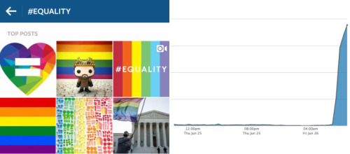
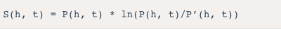
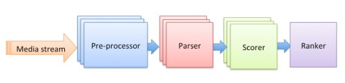
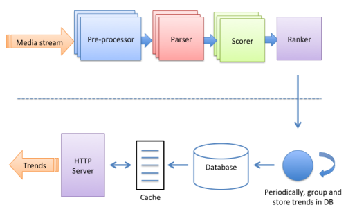

不久前，照片分享应用Instagram推出了搜索与浏览功能。浏览页面上的热门标签和地点是社区中一些最受欢迎的内容，而其背后是一个每天可以解析7000多万张新增图片的系统。近日，Instagram技术博客介绍了支撑该系统的热门趋势发现算法。

直观地讲，热门标签是一个比平时用得多的标签，而这种情况是由那个时刻发生的特定事件所导致。比如，在Instagram撰写那篇博文时，#equality就是一个热门标签，即当时有许多人用它分享图片：

趋势识别

通过标签热度变化可以识别趋势。Instagram认为，一个良好的趋势要具备三个要素：

.流行度——社区中要有许多人对该趋势感兴趣
.新颖性——该趋势是关于一些新东西
.时效性——该趋势是在真实事件发生时出现在Instagram上的

识别趋势需要量化当前观察到的活动（分享照片和视频的数量）与预期活动的差异。如果前者高于后者，就可以确定某个趋势。比如上文提到的标签#equality，通常每个小时只有几张照片及视频用到它。但从太平洋时间上午7点开始，有数以千计的人用它分享内容。就是说，活动多于预期，标签#equality代表一种趋势。

对于每个标签和地点，他们会记录过去七天中每五分钟内有多少媒质在分享时用到了它，该数量表示为C(h, t)，即标签h在时间点t的计数（也就是，在t-5到t时段里以h作为标签的帖子数量）。由于该计数在不同的标签或不同的时点之间差别很大，所以将其规范化为在时点t观察到h的概率P(h, t)。此外，他们还构建了一个模型，用于计算预期数量C’(h, t)，并得出预期概率P’(h, t)。现在，就可以使用一种常见的概率差异度量方法“KL散度（KL divergence）”计算实际概率与预期概率的差异，公式如下：

其中，P(h, t)可以体现流行度，P(h, t)/P’(h, t)可以体现新颖性，而t则体现出时效性。

趋势预测

预测是指根据过去的观察计算预期基准概率。在这个过程中，需要权衡准确性与计算的时空复杂度。通常，准确性会与时空复杂度呈一定的正比关系。他们测试了不同的可选方案，包括取上周同一时间的计数、回归模型、神经网络。最终，他们选择使用上周测量值中的最大概率，这有如下好处：

容易计算，内存需求相对较低
可以抑制具有高方差的非趋势
可以快速识别新兴的趋势
这里有两点需要说明一下。一是，由于大多数标签在五分钟内的计数都非常小，甚至为0，所以他们在计算旧的计数时以小时为单位，而且他们会查看几个小时的数据，以最小化随机使用高峰的干扰。二是，如果某个标签过去没有出现过，那么他们会将该标签在那个时间窗口内的计数置为3，依据是大多数标签在一个小时出现次数都不超过3。

趋势排列

这一步是根据KL散度值S(h, t)排列标签。他们发现，部分趋势消失地很快，但实际上仍然有人对其感兴趣。为了解决这个问题，他们引入了指数衰减函数，用它定义趋势的生存期。S(h, tmax)=SM(h)表示标签h在时点tmax时取得最大KL散度值，则其指数衰减值为：

Sd(h, t) = SM(h) * (½)^((t - tmax)/half-life)
其中，衰减参数“半衰期（half-life）”为2小时，是指SM(h)每过两个小时就会减半。

趋势聚合

通常，人们会用多个标签描述同一事件，当一个事件热门时，描述该事件的多个标签都会成为趋势。因此，需要将这些概念上相同的标签聚合成一个趋势。这有两个方面的工作：一是识别出谈论同一事件的标签，二是找出最能代表该事件的标签。对于第一项，他们通过以下维度计算标签相似度：

.共现率——在最近的媒质中，一个标签同其它标签一起出现的次数。
.编辑距离——同一标签的不同拼写（或错别字），通过Levenshtein距离来计算。
.主题分布——描述同一事件、但拼写不同（如#gocavs、#gowarriors）的标签不大可能一起出现。他们将标题中的标签通过一个内部工具分类到一组预定义的主题中。然后计算每个标签的主题分布，并使用TF-IDF将其标准化。
趋势聚合过程即是根据每一对趋势标签的相似度将它们分组。

系统设计

他们将趋势发现后台设计成一个有四个节点的流处理应用程序，如下图所示：

每个节点都有特定的作用：

.pre-processor——从原始媒质中抽取所需数据。
.parser——抽取描述照片或视频的标签或地点，并过滤。
.scorer——统计每个趋势在某个时段内的出现次数，并计算KL散度值S(h, t)。
.ranker——将所有的候选趋势聚合并排序。

该系统需要实时处理大量数据，并具有高效和容错特性。上述线性架构使他们可以将趋势划分，并启动每个节点的多个实例，实现并行处理。而且，某个划分或实例出现问题都不会影响整个系统。

上面讨论的是趋势发现过程，而发现的趋势通过下图所示的方式提供给应用请求：

可以看出，来自Instagram应用的趋势标签和地点请求不会增加趋势发现后台的负载，因为应用的请求是由memcached缓存和Postgres数据库提供，其中数据库中存储了ranker的计算结果。

后续，他们考虑将该项目分解成多个更小的问题，每个问题由具有特定功能的组件单独处理。这样，他们团队中的每个人就可以一次只关注一个问题。

转载:http://www.infoq.com/cn/news/2015/07/Instagram-equality?comefrom=http://blogread.cn/news/